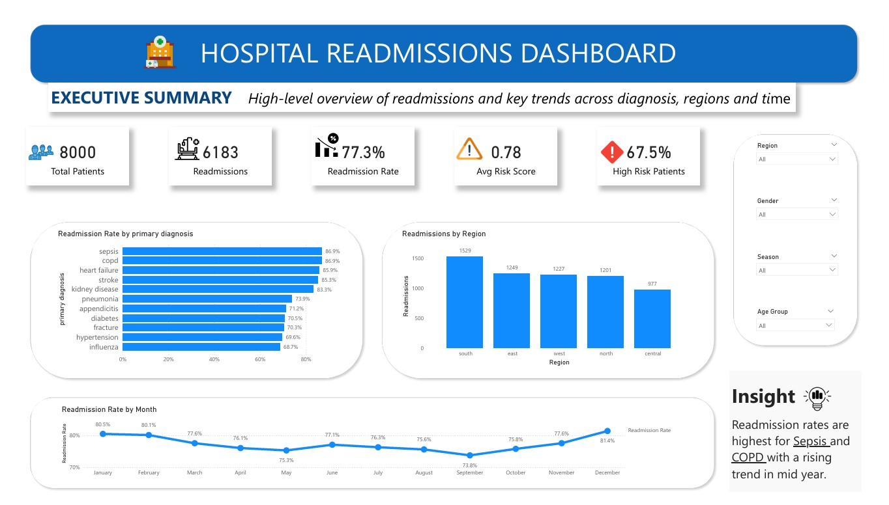
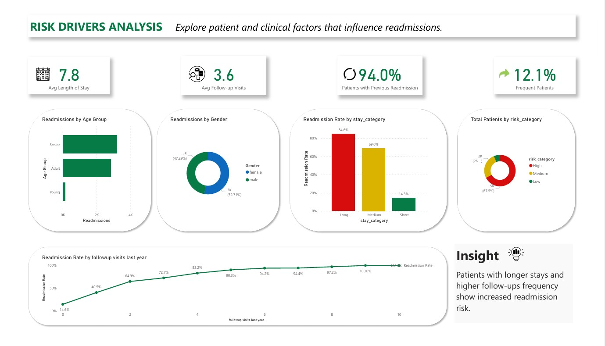
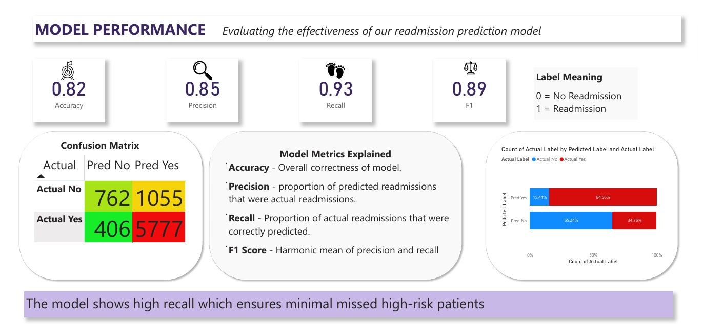

# 🏥 Hospital Readmission Analysis & Prediction Dashboard

---

## 📖 Overview

This project delivers a production-style healthcare analytics pipeline designed to analyze and predict hospital readmission risk using structured SQL transformations and a Power BI semantic model.

It focuses on:
- Clinical risk stratification
- Readmission driver analysis
- Predictive performance evaluation
- Executive decision intelligence dashboards
---

## 🎯 Objectives
- Identify drivers of hospital readmissions across diagnoses and patient cohorts 
- Build a scalable risk segmentation framework (Low / Medium / High)  
- Evaluate predictive model performance with clinical emphasis on recall 
- Enable healthcare stakeholders to make data-driven intervention decisions 

---

## 🛠️ Tools Used
- MySQL (Data Cleaning & Transformation)  
- Power BI (Dashboard & Visualization)  
- DAX (Measures & KPIs)  

---

## 📊 Dashboard Preview

### Executive Overview

### Risk Drivers Analysis

### Model Performance

---

## 🔍 Key Insights
- Readmission rates are highest for Sepsis and COPD  
- Patients with longer hospital stays show significantly higher readmission risk  
- 67.5% of patients are classified as high-risk  
- Follow-up visits strongly correlate with readmission likelihood  

---

## 🤖 Model Performance
- Accuracy: **82%**  
- Precision: **85%**  
- Recall: **93%**  
- F1 Score: **89%**  

The model prioritizes recall to ensure high-risk patients are not missed, which is critical in healthcare applications.

---

## 🧠 SQL Data Pipeline

The dataset was processed using a structured SQL pipeline:

**Raw → Staging → Feature Engineering → Analytics Views → Power BI**

### 🔹 Data Validation
- Verified no duplicate patient records  
- Checked for missing values in key fields  

### 🔹 Staging Layer
- Standardized categorical values (lowercase, trimmed)  
- Converted date formats for consistency  

### 🔹 Feature Engineering
- Created **risk categories** (Low / Medium / High)  
- Derived **length of stay categories**  
- Classified patient behavior (Frequent vs Normal readmissions)  

### 🔹 Analytics Views
- `vw_patient_details` → Main dataset for reporting  
- `vw_readmission_summary` → KPI metrics  
- `vw_diagnosis_analysis` → Diagnosis-level insights  
- `vw_risk_vs_actual` → Risk segmentation validation  

📁 Full SQL scripts are available in the `/sql` folder.

---

## 🚀 Business Impact
This analysis enables healthcare providers to:
- Identify high-risk patients early  
- Reduce readmission rates  
- Improve resource allocation and patient care strategies  

---
